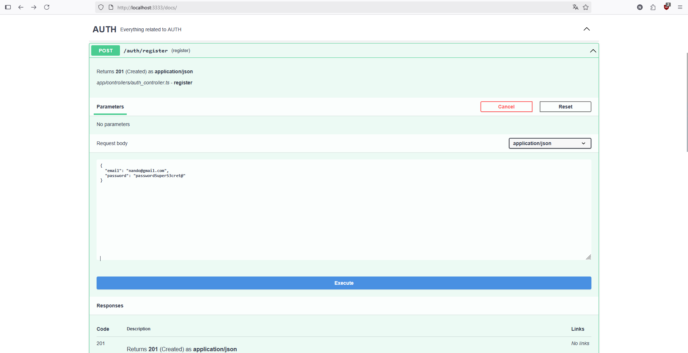
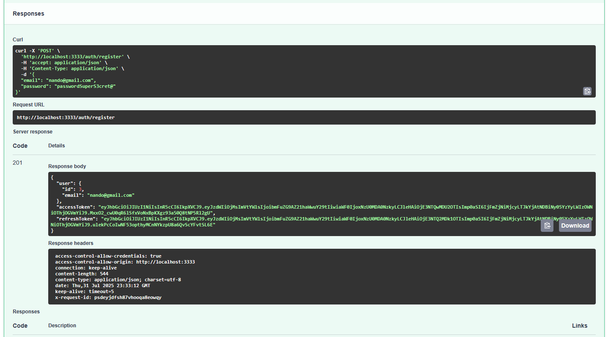
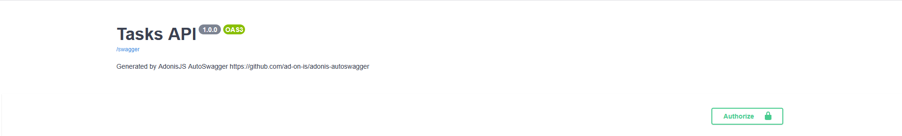
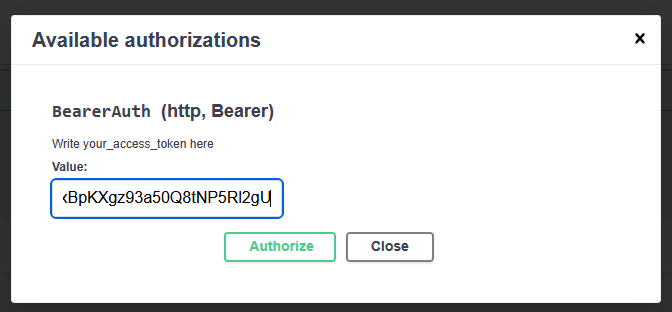

# TASK API

Este projeto é uma API de gerenciamento de tarefas construída com o framework AdonisJS. Ele oferece um conjunto completo de endpoints para autenticação de usuários e operações CRUD (Criar, Ler, Atualizar, Excluir) em tarefas.

## Funcionalidades

- **Autenticação de Usuário:** Registro, login e logout com JWT (JSON Web Tokens). A API utiliza tokens de acesso e de atualização para gerenciar as sessões.

- **Gerenciamento de Tarefas:** Os usuários autenticados podem criar, visualizar, listar, atualizar e excluir ***somente*** suas próprias tarefas. Cada tarefa tem um título, descrição e um status (pendente ou concluída).

- **API Documentada:** Documentação da API disponível em /docs após a geração do swagger.yml.

- **Configuração de Ambiente:** Configuração flexível através de variáveis de ambiente para banco de dados, JWT e outras opções.

- **Testes:** O projeto inclui testes funcionais para os controladores de autenticação e tarefas, e testes de unidade para os modelos.

## Instalação

### Pré-requisitos

- Docker e Docker Compose
- Node

### Usando Docker Compose

A maneira mais fácil de iniciar o projeto é usando Docker Compose. O arquivo `docker-compose.yml` define dois serviços: app (relacionado a aplicação AdonisJS) e o db (relacionada ao banco de dados MySql).

1. Crie o arquivo `.env` a partir do exemplo fornecido:

    ```
    TZ=UTC
    PORT=3333
    HOST=0.0.0.0
    LOG_LEVEL=info
    APP_KEY=
    NODE_ENV=
    DB_HOST=db
    DB_PORT=3306
    DB_USER=task_user
    DB_PASSWORD=t4Sk_password
    DB_DATABASE=app
    DB_CONNECTION=mysql
    JWT_SECRET=
    ACCESS_TOKEN_EXPIRES_IN="15m"
    REFRESH_TOKEN_EXPIRES_IN="7d"
    ```

2. Preencha o arquivo `.env` com as configurações necessárias, especialmente **NODE_ENV** que pode ser *development* ou *production*,
APP_KEY e JWT_SECRET. Sendo essas duas últimas strings aletórias e seguras.

    ```
    NODE_ENV=production
    APP_KEY=sua_chave_segura_aqui
    JWT_SECRET=seu_segredo_jwt_aqui
    ```

    > Você consegue gerar elas usando os seguintes comandos, respectivamente: `node ace generate:key` e `node -e "console.log(require('crypto').randomBytes(32).toString('hex'))"`

3. Vá até o terminal e inicie os serviços do Docker:

    ```bash
    docker compose up --build
    ```

    Este comando irá construir a imagem da aplicação, configurar o container do banco, executar as migrações necessárias e os testes automatizados (caso esteja rodando em ***production***)

## Endpoints da API

A API expõe os seguintes endpoints, protegidos por autenticação JWT, quando aplicável:

### Autenticação (/auth)

- **POST /auth/register:** Registra um novo usuário com e-mail e senha.

- **POST /auth/login:** Realiza o login de um usuário e retorna tokens de acesso e de atualização.

- **POST /auth/refresh:** Atualiza um token de acesso expirado usando o token de atualização.

- **POST /auth/logout:** Revoga a sessão do usuário.

- **GET /auth/me:** Retorna os dados do usuário autenticado.

### Tarefas (/tasks)

Estes endpoints exigem autenticação.

- **POST /tasks:** Cria uma nova tarefa. Requer title, description e status (pendente ou concluída).

- **GET /tasks:** Retorna todas as tarefas do usuário autenticado.

- **GET /tasks/:id:** Retorna uma tarefa específica por ID.

- **PUT /tasks/:id:** Atualiza todos os campos de uma tarefa.

- **PATCH /tasks/:id:** Atualiza parcialmente uma tarefa.

- **DELETE /tasks/:id:** Exclui uma tarefa


## Na documentação (Swagger)

Para acessar a documentação com os respectivos endpoints acima, acesse http://localhost:3333/docs.

1. Crie uma conta para se autenticar ao sistema.



2. Copie o ***token de acesso***.



3. Vá até o topo da página e clique em **Authorize**



4. Insira o ***token de acesso JWT*** sem as aspas duplas no input e clique em **Authorize**:



5. Agora você pode usar os endpoints bloqueados! Seja feliz!

---

### Espero que gostem :)